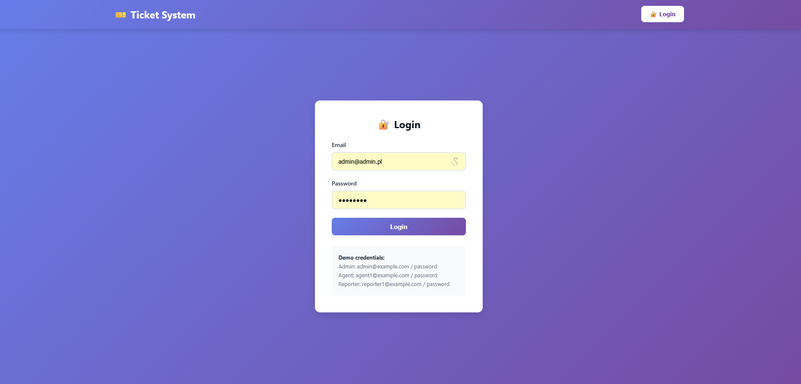
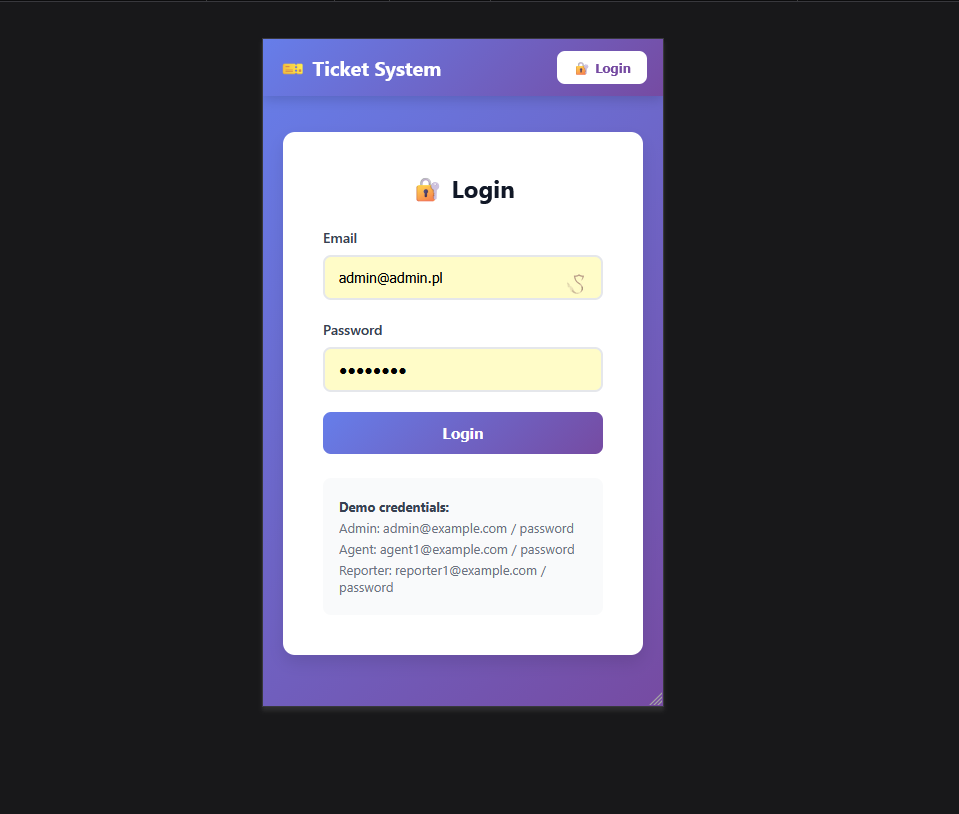
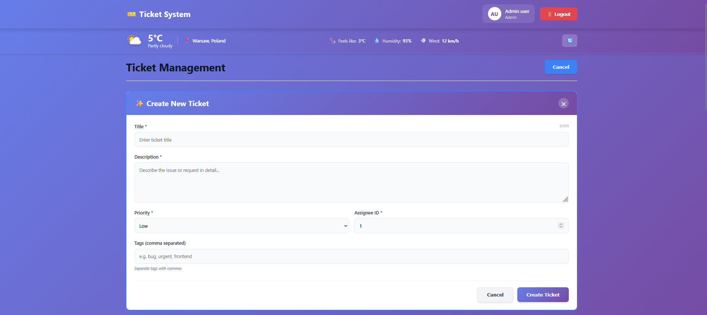
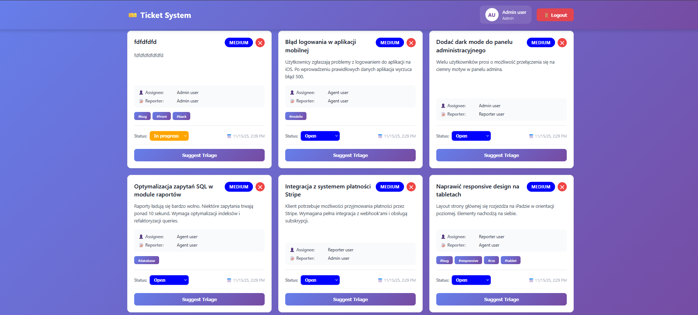
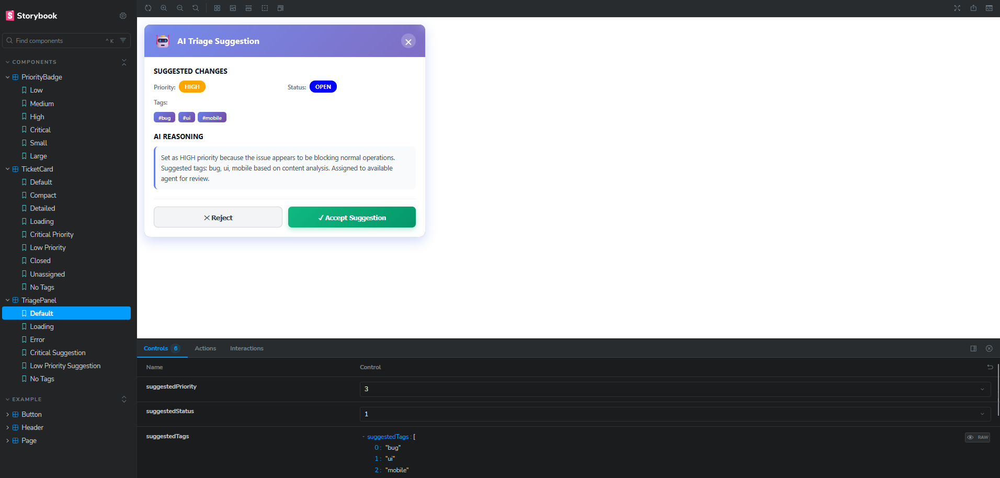

# Helpdesk Lite - Aplikacja z Asystentem LLM

## 📋 Spis treści
- [Opis projektu](#opis-projektu)
- [Technologie](#technologie)
- [Wymagania](#wymagania)
- [Uruchomienie aplikacji](#uruchomienie-aplikacji)
- [Funkcjonalności](#funkcjonalności)
- [LLM Flow](#llm-flow)
- [Struktura projektu](#struktura-projektu)
- [Testowanie](#testowanie)
- [Decyzje architektoniczne](#decyzje-architektoniczne)

## 📖 Opis projektu

Helpdesk Lite to aplikacja do zarządzania ticketami z inteligentnym asystentem triage opartym na LLM. Aplikacja umożliwia zgłaszanie, przeglądanie i kategoryzowanie zgłoszeń z podziałem na role użytkowników.

### Główne cechy:
- ✅ System ról (admin, agent, reporter)
- ✅ CRUD ticketów z filtrowaniem po stronie backendu
- ✅ Asystent triage oparty na mock LLM
- ✅ Integracja z zewnętrznym API WeatherAPI
- ✅ Design System z Storybook
- ✅ Responsywny interfejs

## 🛠 Technologie

### Backend
- Laravel 12
- PHP 8.2+
- MySQL 8
- Laravel Sanctum (autoryzacja)
- PHPUnit (testy)

### Frontend
- Angular 16
- RxJS & Signals
- Storybook 10
- TypeScript

### Infrastruktura
- Docker & Docker Compose

## 📦 Wymagania

- Docker Desktop 20.10+
- Docker Compose 2.0+
- Node.js 18+ (opcjonalnie, dla lokalnego developmentu)
- Git

## 🚀 Uruchomienie aplikacji

### 1. Klonowanie repozytorium

```bash
git clone <repository-url>
cd [katalog]
```

### 2. Konfiguracja backendu

```bash
# Skopiuj przykładowy plik środowiskowy
cp backend/.env.example backend/.env

# Zbuduj i uruchom kontenery
docker-compose up -d --build
```

### 3. Inicjalizacja bazy danych

```bash
# Wejdź do kontenera Laravel
docker exec -it laravel_app bash

# Uruchom instalacje composerem
composer install

# Wygeneruj klucz aplikacji
php artisan key:generate

# Uruchom migracje i seedy
php artisan migrate
php artisan db:seed

# Wyjdź z kontenera
exit
```

### 4. Konfiguracja frontendu

```bash
# Instalacja
npm install
```

### 5. Dostęp do aplikacji

- **Frontend (Angular)**: http://localhost:4200
- **Backend API (Laravel)**: http://localhost:8000
- **MySQL**: localhost:3317
- **Storybook** z poziomu terminarza (nie kontener):
  ```bash
  cd frontend
  npm run storybook
  ```
  Dostępny na: http://localhost:6007

### 6. Dane testowe

Po uruchomieniu seedów dostępne są konta:

| Email | Hasło | Rola |
|-------|-------|------|
| admin@admin.pl | password | admin |
| agent@admin.pl | password | agent |
| reporter@admin.pl | password | reporter |

## ⚙️ Funkcjonalności

### System użytkowników
- Logowanie z Laravel Sanctum
- 3 role: admin, agent, reporter
- Reporter widzi tylko swoje tickety
- Agent widzi przypisane do siebie tickety
- Admin widzi wszystkie tickety
- Agent i Admin mogą zarządzać ticketami

### Zarządzanie ticketami
- Tworzenie, edycja, usuwanie ticketów
- Pola: title, description, priority, status, assignee, reporter, tags
- Filtrowanie po statusie, priorytecie, przypisaniu, tagach
- Historia zmian statusu

### Triage Asystent (LLM)
- Przycisk "Zasugeruj triage" przy szczegółach ticketu
- Endpoint: `POST /api/tickets/{id}/triage-suggest`
- Analiza ticketu przez LLM (mock)
- Sugestie
- Użytkownik może zaakceptować lub odrzucić sugestię

### Integracja z API
- **Weather API**: pogoda
- Endpoint: `GET /current.json`
- Lokalizacja: navigator.geolocation ?? Warszawa
- Obsługa błędów i timeoutów

### Design System
- Własne komponenty w Storybook:
    - **PriorityBadge**: wizualizacja priorytetu (Low/Medium/High/Critical)
    - **TicketCard**: kompaktowa karta ticketu
    - **TriageSuggestionPanel**: panel z sugestiami LLM
- Responsywny design (desktop + mobile)

## 🤖 LLM Flow

### Strategia wykorzystania LLM

W trakcie realizacji projektu wykorzystałem **Claude 4.5 Sonnet** jako główne narzędzie wspierające development. Poniżej przedstawiam szczegółowy proces pracy z LLM.

### 1. Analiza wymagań i architektura

#### Prompt początkowy:
```
Analizuję zadanie rekrutacyjne: Helpdesk Lite z Laravel + Angular.
Wymagania:
- Backend: Laravel 12, REST API, Sanctum, PHPunit
- Frontend: Angular 16+, Storybook, signals
- LLM triage assistant
- Integracja z publicznym API
- Docker Compose

Zaproponuj architekturę projektu i kolejność zadań
```

#### Rezultat:
LLM zaproponował flow wykonywania zadań zawartych w treści otrzymanego pdf

### 2. Implementacja backendu

#### Przykładowe prompty:

**Generowanie kodu backendu:**
```
Stwórz dla podanej migracji model, kontroler, serwis i repozytorium pod CRUD
```

**Integracja z LLM API:**
```
Zaimplementuj TriageService który będzie symulował komunikację z LLM:
- Przyjmuje ticket
- Wysyła do OpenAI API (gpt-4) z promptem o sugestię priorytetu i kategorii
- Zwraca strukturę: {priority, category, reasoning, confidence}
- Obsługuje błędy (timeout, API limit, invalid response)
- Ma fallback do prostego rule-based classifiera
Dodaj mock dla testów.
```

### 3. Implementacja frontendu

#### Komponenty w Storybook:

**PriorityBadge:**
```
Stwórz Angular component PriorityBadge:
- Input: priority ('low' | 'medium' | 'high' | 'critical')
- Wyświetla badge z odpowiednim kolorem i ikoną
- Wspiera light/dark mode
- Dodaj stories: wszystkie priorytety, sizes, disabled state
```

**TriageSuggestionPanel:**
```
Komponent Angular do wyświetlania sugestii triage:
- Inputs: suggestion (priority, category, reasoning), loading, error
- Wyświetla sugestię w czytelnej formie
- Przyciski: Accept, Reject
- Loading skeleton podczas ładowania
- Error state z retry
Dodaj stories dla wszystkich stanów.
```

### 4. Integracja komponentów

#### Prompt dla złożonych interakcji:
```
Implementuj tickets zgodnie z trescia zadania: (...)
```

### 5. Rozwiązywanie problemów

#### Przykład: CORS w Docker

**Prompt:**
```
Frontend w Docker (localhost:4200) nie może połączyć się z backend (localhost:8000).
Błąd: CQRS policy blocked.
Oto mój kod, jeżeli czegoś potrzebujesz to pytaj:
[wklejony docker-compose.yml]
```


#### Przykład: Testy jednostkowe

**Prompt:**
```
Wyjaśnij co tu jest nie tak?
[BŁĄD]
[KOD TESTU JEDNOSTKOWEGO]
```

### 6. Walidacja i iteracje

Po otrzymaniu kodu od LLM zawsze:

1. **Najpierw wklejam i sprawdzam czy działa** - zdarza się, ze czat podaje nie działające rozwiązania
2. **Poprawki** - jeżeli kod działa lub 'prawie działa' to go poprawiam i dokładnie sprawdzam
3. **Doprecyzowuję prompt** jeżeli coś nie działa, ale wiem co jest nie tak i wiem, ze LLM zrobi to szybciej niz ja podaję mu instrukcję, co należy poprawic w kodzie z poprzedniej odpowiedzi. Jeżeli widzę, ze zaczyna halucynować zaczynam nowy czat i probuję od nowa.
   ```
   Zapomniałeś obsłużyc filtrowanie po tagach, dodaj input dla tagów w sekcji filtrów.
   ```
4. **Refaktoruję** według własnych preferencji (nazewnictwo, struktura, architektura)

### Wnioski z pracy z LLM (Claude)

#### ✅ Co działa dobrze:
- Frontend
- Generowanie podstawowego kodu (migracje, modele, podstawowe CRUD)
- Propozycje architektury i wzorców projektowych
- Dokumentacja i komentarze
- Claude doskonale pamięta kontekst rozmowy, nie zauwazyłem w ostatnim czasie problemów z pamięcią

#### ⚠️ Wyzwania:
- **Halucynacje**: LLM czasami wymyśla własne wymagania zamiast sugerować się treścią prompta
    - *Rozwiązanie*: Korekta promptu, nowy czat
- **Przestarzałe praktyki**: Sugestie deprecated metod
    - *Rozwiązanie*: Wskazanie wersji (Laravel 12, Angular 16)

#### 💡 Najlepsze praktyki:
1. **Jasne, szczegółowe prompty** z kontekstem (wersje, wymagania, duzo szczegolow, sugerowanie sposobu rozwiazania)
2. **Iteracyjne podejście** - małe kroki, weryfikacja - tylko 1 zadanie na raz np. zamiast pisać zrob filtrowanie tagów i zmien kolorek panelu rozdzielamy na 2 osobne polecenia
3. **Własna walidacja** - kod nalezy uwaznie sprawdzic pod wzgledem logiki
4. **Testy** - testy warto pisać samodzielnie, LLM (w tym przypadku Claude) radzi sobie gorzej niz z pozostalymi zagadnieniami

## 🧪 Testowanie

### Backend
```bash
# Wejdź do kontenera
docker exec -it laravel_app bash

# Uruchom wszystkie testy
php artisan test

# Uruchom konkretny test
php artisan test --filter TicketServiceTest
```

## 🏗️ Decyzje architektoniczne

### Backend

1. **Repository Pattern**: Izolacja logiki dostępu do danych od kontrolerów i serwisów
2. **Service Layer**: Logika biznesowa oddzielona od HTTP
3. **Form Requests**: Walidacja inputów w Requestach
5. **Policy Classes**: Autoryzacja oparta na rolach

### Frontend

2. **Signals**: Reactive state management zamiast RxJS gdzie możliwe
3. **Lazy Loading**: Moduły ładowane na żądanie
4. **Interceptory**: Centralna obsługa tokenów i błędów HTTP
5. **Design System**: Reużywalne komponenty w Storybook


## 📸 Screenshots







## 📝 Licencja

MIT

## 👤 Autor

Dawid Metelski - Zadanie rekrutacyjne Helpdesk Lite

---

**Czas realizacji**: ~ 9 godzin  
**Status**: MVP gotowe do prezentacji